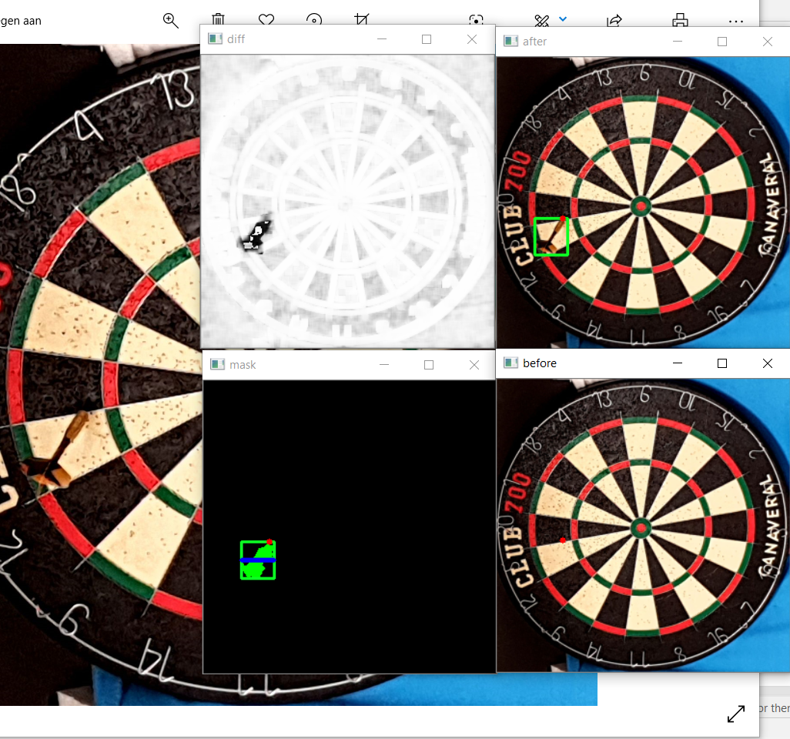
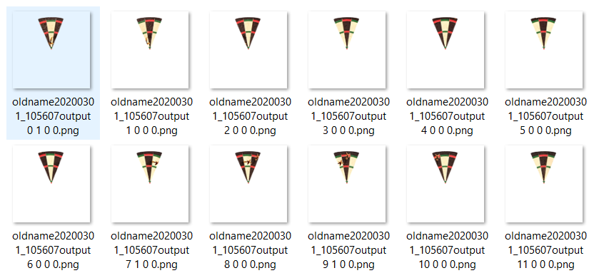

# Darts

## Update 12/03

### score-calculator
We gebruiken OpenCV om het verschil tussen 2 foto's te berekenen. Over de verschillen plaatsen we een bounding box en een mask.

Voor het bepalen van de punt kijken we enkel naar de uiterste pixel. Indien de pijl naar boven zit, nemen we de hoogste pixel. Indien de pijl naar links zit, nemen we de uiterst linkse pixel, enz.

Via de bounding box krijgen we een rechthoek. Hiermee kunnen we bepalen of de pijl horizontaal of verticaal in het bord zit. We splitsen de rechthoek zo op, dat in één deel de punt zit en in het andere deel de staart. Vervolgens bepalen we voor elk klein rechthoekje een gewicht dat overeenkomt met de hoeveelheid pixels. Het grootste gewicht bevat de staart. Het kleinste gewicht bevat de punt.

De coördinaten omzetten naar een score gebeurt via de afstand en hoek tegenover het middelpunt. Via de hoek weten we in welk vakje de pijl zit en via de afstand kunnen we bepalen of het zich bevindt in x3, x2, x1, buitenroos of roos.

## Update 10/03

Ik heb een paar aanpassingen gedaan aan de dataset. De 2 buren van de uitgeknipte stukjes staan er nu ook bij zodat een groter deel van de pijl zichtbaar is. Dataset is ondertussen ook gedraaid zodat de vakjes altijd op dezelfde plaats staan. Voor het labelen geven we mee hoeveel pijltjes er in de trippel, dubbel of enkel zitten. Bijvoorbeeld 0 0 0  => geen enkel pijtlje.

We hebben veel vordering gemaakt met OpenCV dus daar komt ook nog een update over deze week.

## Update 2/03

Ik wou nu toch nog eens kijken/bespreken waarom keras niet de juiste aanpak is. Ik heb dus een kleine dataset aangemaakt waarmee ik zou willen zien of de AI simpelweg een pijltje kan herkennen of niet. Ik denk dat een te grote dataset een van de grote problemen is die deze mogelijkheid beperkt dus we houden alles zo eenvoudig mogelijk.

We kijken enkel naar één driehoekje van het bord. Hiervoor heb ik 2 scriptjes geschreven. Het eerste neemt (met vastliggende coördinaten) het center. Het 2de snijdt de vakjes eruit en maakt van 1 foto 20 foto's. Dit hielp enorm om op een korte tijd toch een degelijke dataset te maken.

### cropper

### pizzacutter

 

 

Nu zou ik enkel nog de foto's moeten kunnen draaien om de data te normaliseren (ze zijn gelabeld met hoeveel graden ze nog moeten draaien) en dan nog labelen met waar het pijltje zit. Wanneer dit gebeurd is kan ik een paar dingen uitproberen en bespreken in mijn bachelorproef indien er interessante resultaten zijn.

Ik heb momenteel 87 foto's met 5 pijltjes -> 1740 pizza's waarvan 435 met pijltje. 

Op mijn stage begin ik deze week met een opstelling te maken met opencv.
