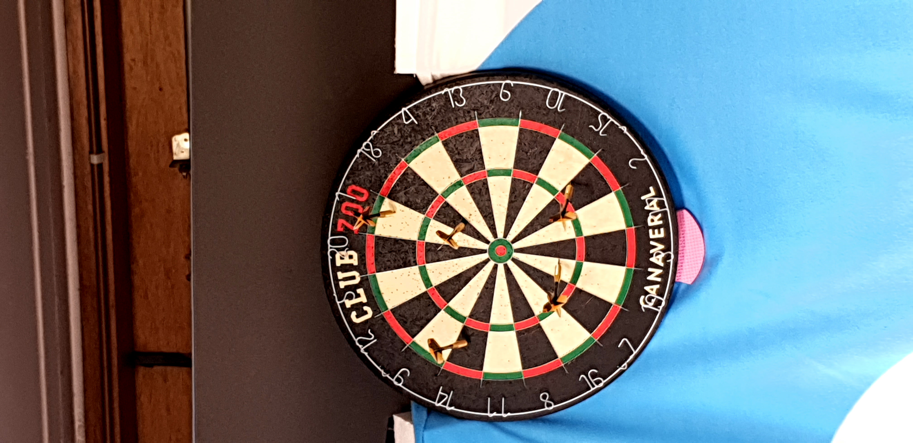
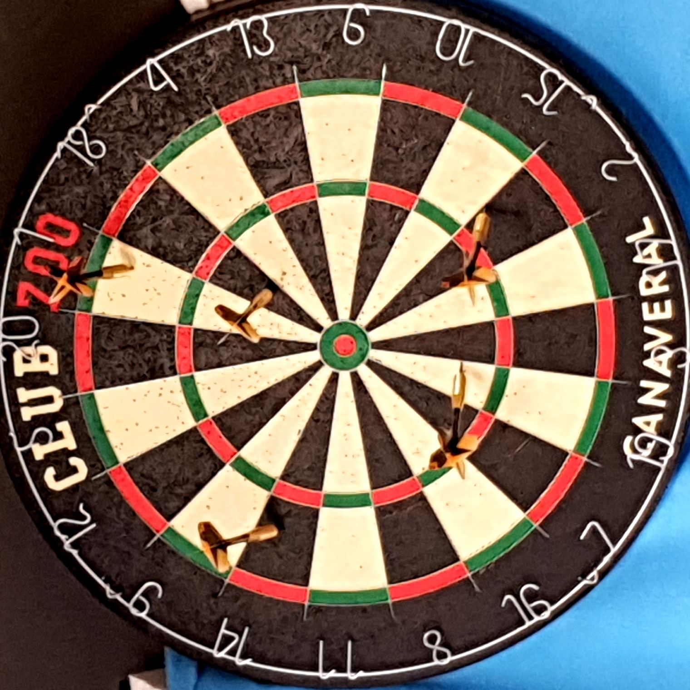
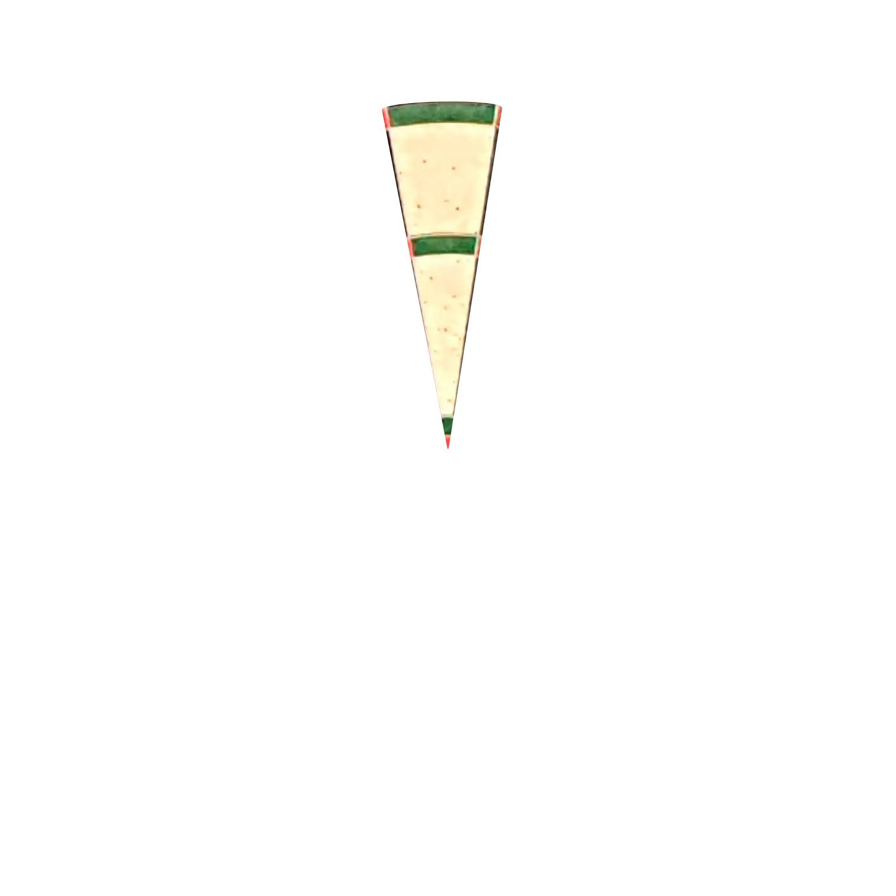
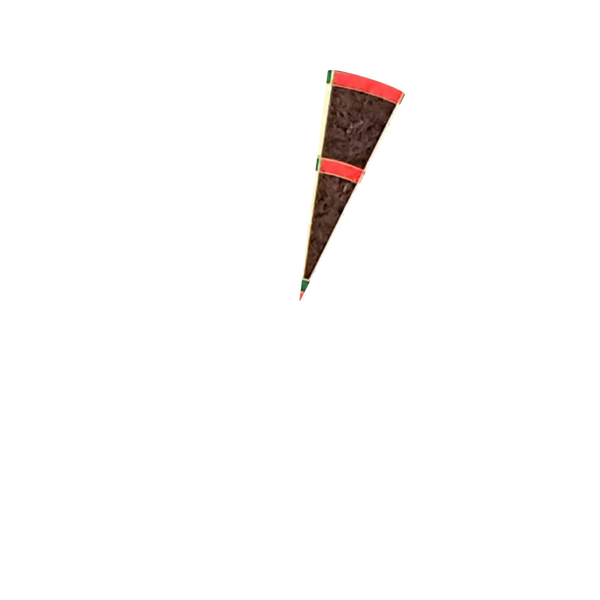
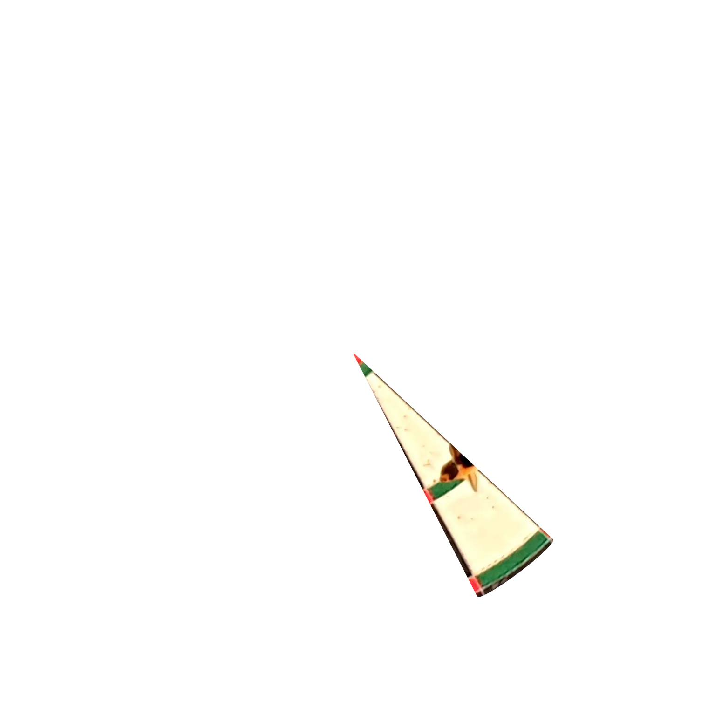
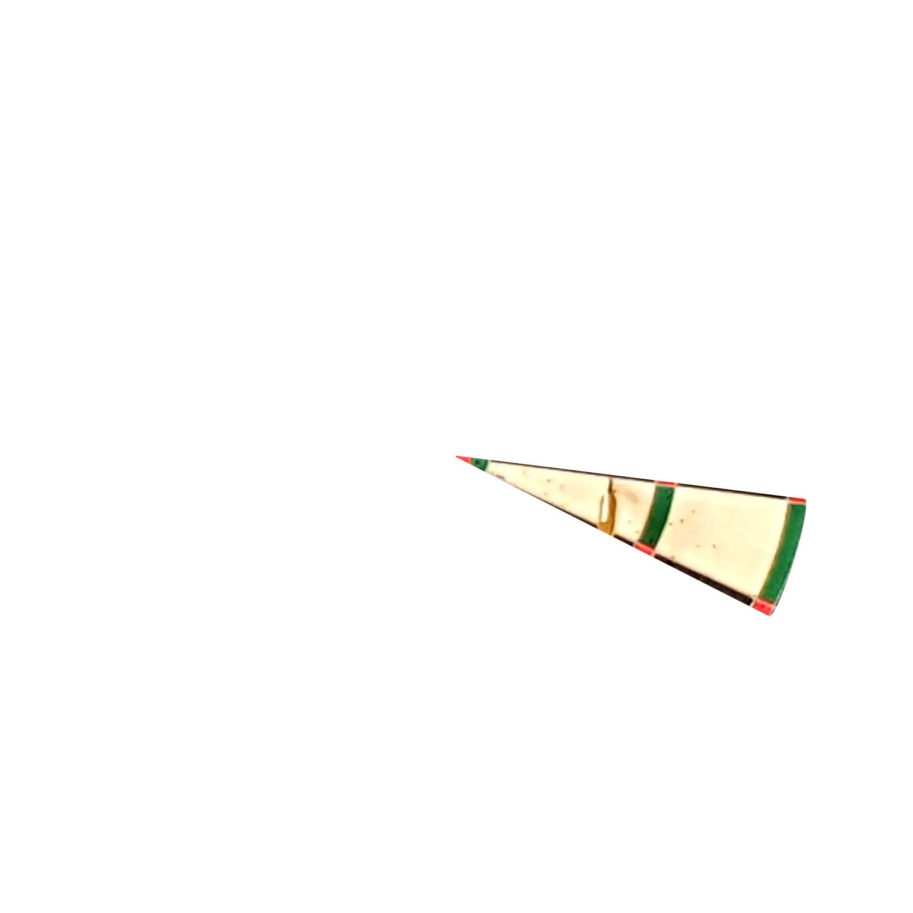

# Darts

## Update

Ik wou nu toch nog eens kijken/bespreken waarom keras niet de juiste aanpak is. Ik heb dus een kleine dataset aangemaakt waarmee ik zou willen zien of hij simpelweg een pijltje kan herkennen of niet. Ik denk dat een te grote dataset een van de grote problemen is die deze mogelijkheid beperkt. Ik heb geprobeerd dit probleem zoveel mogelijk weg te werken om het toch te kunnen bespreken.

Om het zo simpel mogelijk te maken kijken we dus enkel naar één driehoekje van het bord. Hiervoor heb ik 2 scriptjes geschreven. Het eerste neemt (met vastliggende coordinaten) het center. Het 2de snijdt de vakjes eruit en maakt van 1 foto 20. Dit hielp enorm om op een korte tijd toch een degelijke dataset te maken.

## cropper

## pizzacutter

 

 

Nu zou ik enkel nog de foto's moeten kunnen draaien om de data te normaliseren (ze zijn gelabeld met hoeveel graden ze nog moeten draaien) en dan nog labelen met waar het pijltje zit. Wanneer dit gebeurd is kan ik een paar dingen uitproberen en bespreken in mijn bachelorproef indien er interessante resultaten zijn.

Ik heb momenteel 87 foto's met 5 pijltjes -> 1740 pizzas waarvan 435 met pijltje

Op mijn stage begin ik deze week met een opstelling te maken met opencv.
